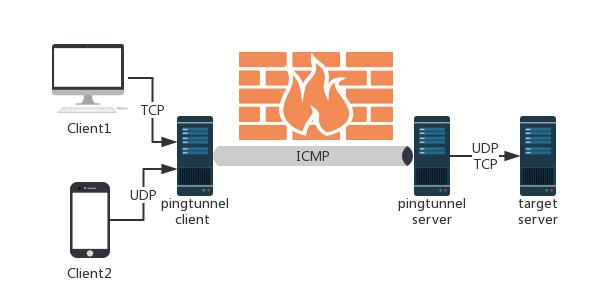
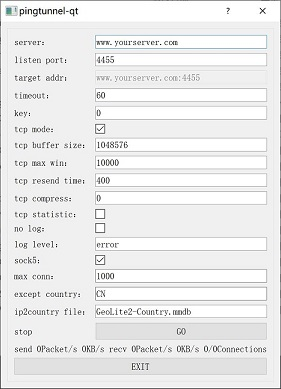
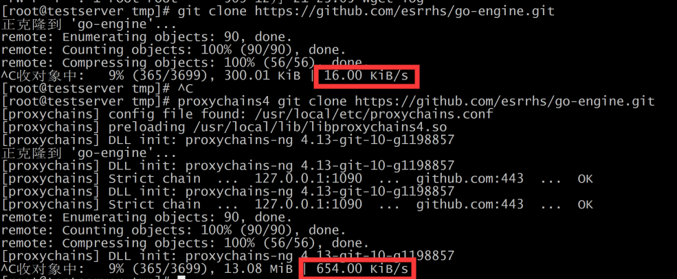

# Pingtunnel

[](https://github.com/esrrhs/pingtunnel)
[](https://github.com/esrrhs/pingtunnel)
[](https://goreportcard.com/report/github.com/esrrhs/pingtunnel)
[](https://github.com/esrrhs/pingtunnel/releases)
[](https://github.com/esrrhs/pingtunnel/releases)
[](https://hub.docker.com/repository/docker/esrrhs/pingtunnel)
[](https://github.com/esrrhs/pingtunnel/actions)
[](https://www.codacy.com/manual/esrrhs/pingtunnel?utm_source=github.com&amp;utm_medium=referral&amp;utm_content=esrrhs/pingtunnel&amp;utm_campaign=Badge_Grade)

pingtunnel是把tcp/udp/sock5流量伪装成icmp流量进行转发的工具。用于突破网络封锁，或是绕过WIFI网络的登陆验证，或是在某些网络加快网络传输速度。

[Readme EN](./README_EN.md)

**注意：本工具只是用作学习研究，请勿用于非法用途！**

**有问题可以加QQ群交流：1023345068**



# 功能
* 某些服务器的tcp、udp流量被禁止，可以通过pingtunnel绕过。
* 某些场合如学校、咖啡厅、机场，需要登录跳转验证，可以通过pingtunnel绕过。
* 某些网络，tcp传输很慢，可以通过pingtunnel加速网络。

# 使用
### 安装服务端
* 首先准备好一个具有公网ip的服务器，如AWS上的EC2，假定域名或者公网ip是www.yourserver.com
* 从[releases](https://github.com/esrrhs/pingtunnel/releases)下载对应的安装包，如pingtunnel_linux64.zip，然后解压，以**root**权限执行
```
sudo wget (最新release的下载链接)
sudo unzip pingtunnel_linux64.zip
sudo ./pingtunnel -type server
```
* (可选)关闭系统默认的ping
```
echo 1 >/proc/sys/net/ipv4/icmp_echo_ignore_all
```
### 安装GUI客户端(新手推荐)
* 从[pingtunnel-qt](https://github.com/esrrhs/pingtunnel-qt)下载qt的gui版本
* 双击exe运行，修改server（如www.yourserver.com）、listen port（如1080），勾上sock5，其他设置默认即可，然后点击*GO*
* 一切正常，界面上会有ping值显示，然后可点击X隐藏到状态栏
* 设置浏览器的sock5代理到127.0.0.1:1080



### 安装客户端(高玩推荐)
* 从[releases](https://github.com/esrrhs/pingtunnel/releases)下载对应的安装包，如pingtunnel_windows64.zip，解压
* 然后用**管理员权限**运行，不同的转发功能所对应的命令如下
* 如果看到有ping pong的log，说明连接正常
##### 转发sock5
```
pingtunnel.exe -type client -l :4455 -s www.yourserver.com -sock5 1
```
##### 转发tcp
```
pingtunnel.exe -type client -l :4455 -s www.yourserver.com -t www.yourserver.com:4455 -tcp 1
```
##### 转发udp
```
pingtunnel.exe -type client -l :4455 -s www.yourserver.com -t www.yourserver.com:4455
```

### Docker
server:
```
docker run --name pingtunnel-server -d --privileged --network host --restart=always esrrhs/pingtunnel ./pingtunnel -type server -key 123456
```
client:
```
docker run --name pingtunnel-client -d --restart=always -p 1080:1080 esrrhs/pingtunnel ./pingtunnel -type client -l :1080 -s www.yourserver.com -sock5 1 -key 123456
```

# 效果
测试pingtunnel的加速效果，服务器位于aws Korea，客户端位于中国大陆。

下载centos镜像 [centos mirror](http://mirror.calgah.com/centos/8/isos/x86_64/CentOS-8.1.1911-x86_64-dvd1.iso) 
直接wget、通过shadowsocks wget、通过pingtunnel wget的结果如下。

|              | wget     | shaowsocks | pingtunnel |
|--------------|----------|------------|------------|
| 阿里云 | 26.6KB/s | 31.8KB/s   | 897KB/s    |
| 移动宽带     | 23.1KB/s | 28.4KB/s   | 408KB/s    |

可以看到加速效果基本上**20倍**。

同样的，克隆github仓库 [go-engine](https://github.com/esrrhs/go-engine.git) ，加速效果也很明显。



# 下载
cmd: https://github.com/esrrhs/pingtunnel/releases

QT GUI: https://github.com/esrrhs/pingtunnel-qt

# Stargazers over time

[](https://starchart.cc/esrrhs/pingtunnel)
      
# Usage
    通过伪造ping，把tcp/udp/sock5流量通过远程服务器转发到目的服务器上。用于突破某些运营商封锁TCP/UDP流量。
    
    Usage:

    // server
    pingtunnel -type server

    // client, Forward udp
    pingtunnel -type client -l LOCAL_IP:4455 -s SERVER_IP -t SERVER_IP:4455

    // client, Forward tcp
    pingtunnel -type client -l LOCAL_IP:4455 -s SERVER_IP -t SERVER_IP:4455 -tcp 1

    // client, Forward sock5, implicitly open tcp, so no target server is needed
    pingtunnel -type client -l LOCAL_IP:4455 -s SERVER_IP -sock5 1

    -type     服务器或者客户端

    server端参数:

    -key      设置的密码，默认0

    -nolog    不写日志文件，只打印标准输出，默认0

    -noprint  不打印屏幕输出，默认0

    -loglevel 日志文件等级，默认info

    -maxconn  最大连接数，默认0，不受限制

    -maxprt   server最大处理线程数，默认100

    -maxprb   server最大处理线程buffer数，默认1000

    -conntt   server发起连接到目标地址的超时时间，默认1000ms

    客户端参数:

    -l        本地的地址，发到这个端口的流量将转发到服务器

    -s        服务器的地址，流量将通过隧道转发到这个服务器

    -t        远端服务器转发的目的地址，流量将转发到这个地址

    -timeout  本地记录连接超时的时间，单位是秒，默认60s

    -key      设置的密码，默认0

    -tcp      设置是否转发tcp，默认0

    -tcp_bs   tcp的发送接收缓冲区大小，默认1MB

    -tcp_mw   tcp的最大窗口，默认10000

    -tcp_rst  tcp的超时发送时间，默认400ms

    -tcp_gz   当数据包超过这个大小，tcp将压缩数据，0表示不压缩，默认0

    -tcp_stat 打印tcp的监控，默认0

    -nolog    不写日志文件，只打印标准输出，默认0

    -noprint  不打印屏幕输出，默认0

    -loglevel 日志文件等级，默认info

    -sock5    开启sock5转发，默认0

    -profile  在指定端口开启性能检测，默认0不开启

    -s5filter sock5模式设置转发过滤，默认全转发，设置CN代表CN地区的直连不转发

    -s5ftfile sock5模式转发过滤的数据文件，默认读取当前目录的GeoLite2-Country.mmdb
              
