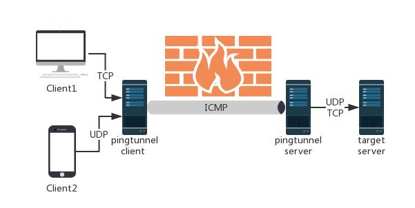

# Pingtunnel

[](https://github.com/esrrhs/pingtunnel)
[](https://github.com/esrrhs/pingtunnel)
[](https://goreportcard.com/report/github.com/esrrhs/pingtunnel)
[](https://github.com/esrrhs/pingtunnel/releases)
[](https://github.com/esrrhs/pingtunnel/releases)
[](https://hub.docker.com/repository/docker/esrrhs/pingtunnel)
[](https://github.com/esrrhs/pingtunnel/actions)

Pingtunnel is a tool that sends TCP/UDP traffic over ICMP.

## Note: This tool is only to be used for study and research, do not use it for illegal purposes



## Usage

### Install server

-   First prepare a server with a public IP, such as EC2 on AWS, assuming the domain name or public IP is www.yourserver.com
-   Download the corresponding installation package from [releases](https://github.com/esrrhs/pingtunnel/releases), such as pingtunnel_linux64.zip, then decompress and execute with **root** privileges
-   “-key” parameter is **int** type, only supports numbers between 0-2147483647

```
sudo wget (link of latest release)
sudo unzip pingtunnel_linux64.zip
sudo ./pingtunnel -type server
```

-   (Optional) Disable system default ping

```
echo 1 > /proc/sys/net/ipv4/icmp_echo_ignore_all
```

### Install the client

-   Download the corresponding installation package from [releases](https://github.com/esrrhs/pingtunnel/releases), such as pingtunnel_windows64.zip, and decompress it
-   Then run with **administrator** privileges. The commands corresponding to different forwarding functions are as follows.
-   If you see ping/pong logs, the connection is normal
-   “-key” parameter is **int** type, only supports numbers between 0-2147483647


#### Forward SOCKS5

```
pingtunnel.exe -type client -l :4455 -s www.yourserver.com -sock5 1
```

#### Forward tcp

```
pingtunnel.exe -type client -l :4455 -s www.yourserver.com -t www.yourserver.com:4455 -tcp 1
```

#### Forward udp

```
pingtunnel.exe -type client -l :4455 -s www.yourserver.com -t www.yourserver.com:4455
```

#### Forward multiple rules from config file

Multiple port mappings can run concurrently in a single process. Create a `config.yaml` with one rule per line, using the same parameters as the command line:

```yaml
- -l :16121 -s www.yourserver.com -t 192.168.0.61:22 -tcp 1
- -l :16122 -s www.yourserver.com -t 192.168.0.62:22 -tcp 1
- -l :16123 -s www.yourserver.com -t 192.168.0.63:22 -tcp 1
```

Then start the client with `-c`:

```
pingtunnel.exe -type client -c config.yaml -noprint 1 -nolog 1
```

Process level flags (`-noprint`, `-nolog`, `-loglevel`, `-encrypt`, `-encrypt-key`, `-profile`...) are set on the command line; any such flags inside a rule are ignored. Parameters set on the command line (like `-key`) act as defaults for every rule. If a rule fails to start, all already started rules are stopped.

### Use Android Client

A dedicated Android client for pingtunnel is now available, developed by the community.

* [**pingtunnel-client**](https://github.com/itismoej/pingtunnel-client)

> Big thanks to [itismoej](https://github.com/itismoej) for developing this Android client!

### Use Docker
It can also be started directly with docker, which is more convenient. It uses the same parameters as above.
-   server:
```
docker run --name pingtunnel-server -d --privileged --network host --restart=always esrrhs/pingtunnel ./pingtunnel -type server -key 123456
```
-   client:
```
docker run --name pingtunnel-client -d --restart=always -p 1080:1080 esrrhs/pingtunnel ./pingtunnel -type client -l :1080 -s www.yourserver.com -sock5 1 -key 123456
```

## Thanks for free JetBrains Open Source license

</a>


